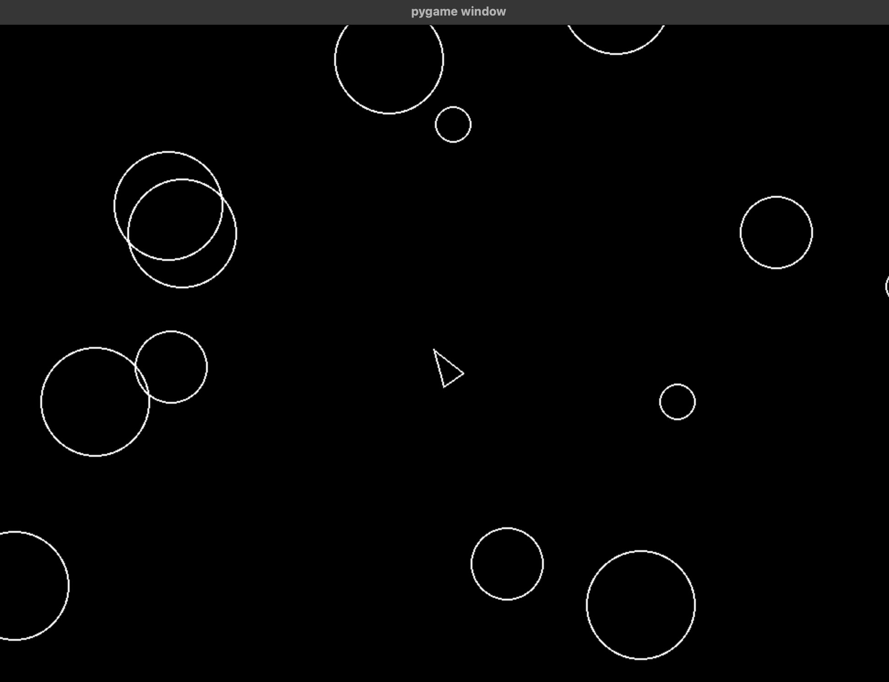

# Asteroids
Python "Asteroids" project to practice Python language basics and object-oriented coding.

Created following [boot.dev](https://www.boot.dev/tracks/backend), built on [pygame](https://www.pygame.org/wiki/GettingStarted).

## Requirements
* python3

## Install
    $ pip install -r requirements.txt

## Run
    $ python3 main.py

## Controls

- `WASD` - Movement
- `Spacebar` - Fire blaster

## Potential Enhancements
- Quick game restart
- Scoring system
- Power-ups/ blaster modifications (ex: multi-shot, larger projectiles)
- Levels with increasing difficulty
